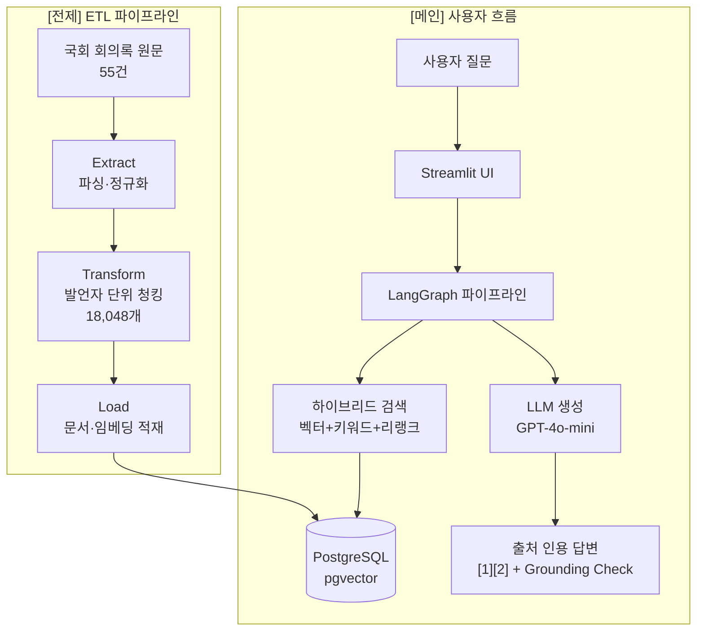

# Day 15 발표·포트폴리오 패키지

> 국회 회의록 근거 기반 질의응답 시스템 — 발표·면접·포트폴리오 제출용

---

## 1. 60초 서사

> 구어체 스크립트 — 발표·면접 모두 이 순서로

국회 외교통일위원회 회의록 55건을 발언자 단위로 분리해 18,048개 청크로 만들고, 이를 PostgreSQL pgvector에 적재했습니다.

사용자가 질문을 입력하면 벡터 검색·키워드 검색·리랭크를 결합한 하이브리드 검색으로 관련 발언을 찾아, LLM이 `[1][2]` 형태의 출처 인용과 함께 답변합니다.

recall@3 100%, RAGAS faithfulness 0.9857, 24개 할루시네이션 방어 케이스 전체 PASS로 근거 기반 답변의 품질을 수치로 증명했습니다.

---

## 2. 데모 스크립트

### 질문 순서 (비교 → 분류 → 요약)

| # | 유형 | 질문 | 기대 출력 패턴 |
|---|------|------|----------------|
| 1 | 비교 | 조태열 장관과 정동영 의원의 대북정책 입장 차이를 비교해줘 | 발언자별 대조 + `[1][2]` 인용 |
| 2 | 분류 | 통일부 장관이 북한 인권에 대해 어떤 입장이야? | 특정 발언자 발언 + 근거 청크 |
| 3 | 요약 | 최근 북핵 비핵화 논의를 요약해줘 | 다수 발언자 종합 + 한계 명시 |

### 실패 시 대사

- **DB 미기동**: "docker-compose up -d 먼저 실행 후 python scripts/healthcheck.py로 확인합니다"
- **모델 파일 없음**: "models/ 경로에 LLaMA 베이스 모델이 필요합니다. .env의 MODEL_DIR_BASE를 확인하세요"
- **OpenAI 키 없음**: "OPENAI_API_KEY 미설정 시 로컬 HF 모델 폴백으로 답변 품질이 낮아질 수 있습니다"

---

## 3. 아키텍처 다이어그램

---

## 4. 핵심 수치 스냅샷

> EVALUATION.md 기준 (2026-06-22)

| 지표 | 수치 |
|------|------|
| 데이터 | 외교통일위원회 회의록 55건 · 청크 18,048개 |
| recall@3 | **100%** (10/10, 비교·분류·요약 전 유형) |
| RAGAS faithfulness | **0.9857** |
| 할루시네이션 방어 | 전 케이스 PASS (인물 날조·허구 문서·수치 날조 등 24개) |
| Grounding Check | FULL / PARTIAL / NONE 3단계, 전 케이스 PASS |
