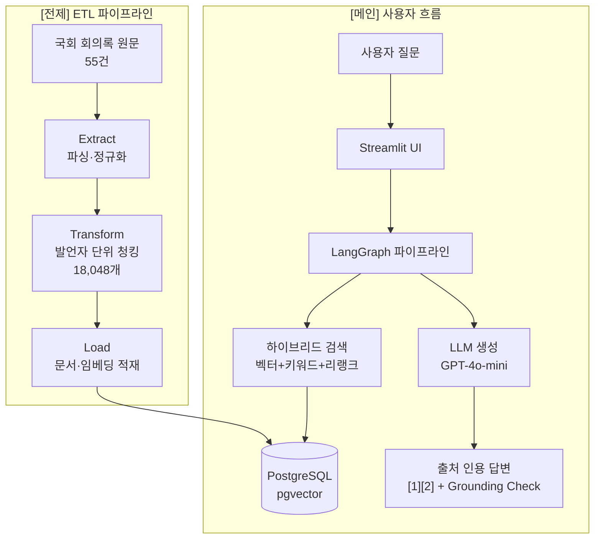

# Day 15 발표·포트폴리오 패키지 Implementation Plan

> **For agentic workers:** REQUIRED SUB-SKILL: Use superpowers:subagent-driven-development (recommended) or superpowers:executing-plans to implement this plan task-by-task. Steps use checkbox (`- [ ]`) syntax for tracking.

**Goal:** 발표·면접·포트폴리오 제출에 바로 쓸 수 있는 패키지를 `docs/presentation/day15-package.md` 한 파일로 완성하고, `docs/dev-log/milestones/day-15.md`를 완료 상태로 교체한다.

**Architecture:** 두 개의 마크다운 파일만 생성·수정한다. `day15-package.md`는 60초 서사·데모 스크립트·Mermaid 다이어그램·수치 스냅샷 4개 섹션으로 구성된다. `day-15.md`는 기존 체크리스트를 완료 상태([x])로 교체한다.

**Tech Stack:** Markdown, Mermaid (GitHub-rendered flowchart TD)

## Global Constraints

- 한국어로 작성 (코드 블록 내 레이블 포함)
- Mermaid 블록은 `flowchart TD`로 시작, USER subgraph + ETL subgraph 두 개 포함
- 데모 질문 순서 고정: 비교 → 분류 → 요약
- 수치 출처: EVALUATION.md 2026-06-22 기준 (recall@3=100%, faithfulness=0.9857, 할루시네이션 24케이스 PASS)
- 실패 대사 3개 모두 포함: DB 미기동 / 모델 파일 없음 / OpenAI 키 없음

---

## File Map

| 파일 | 상태 | 역할 |
|------|------|------|
| `docs/presentation/day15-package.md` | 신규 (디렉토리도 신규) | 발표 패키지 본체 — 4개 섹션 |
| `docs/dev-log/milestones/day-15.md` | 수정 | 완료된 마일스톤 체크리스트 |

---

### Task 1: docs/presentation/day15-package.md 생성

**Files:**
- Create: `docs/presentation/day15-package.md`

**Interfaces:**
- Produces: 4개 섹션 완성 파일 (Task 2에서 링크됨)

- [ ] **Step 1: `docs/presentation/` 디렉토리 확인**

```powershell
New-Item -ItemType Directory -Force "docs\presentation"
```

Expected: 디렉토리 생성 또는 이미 존재 메시지

- [ ] **Step 2: `docs/presentation/day15-package.md` 작성**

아래 내용 그대로 파일 생성:

```markdown
# Day 15 발표·포트폴리오 패키지

> 국회 회의록 근거 기반 질의응답 시스템 — 발표·면접·포트폴리오 제출용

---

## 1. 60초 서사

> 구어체 스크립트 — 발표·면접 모두 이 순서로

국회 외교통일위원회 회의록 55건을 발언자 단위로 분리해 18,048개 청크로 만들고, 이를 PostgreSQL pgvector에 적재했습니다.

사용자가 질문을 입력하면 벡터 검색·키워드 검색·리랭크를 결합한 하이브리드 검색으로 관련 발언을 찾아, LLM이 `[1][2]` 형태의 출처 인용과 함께 답변합니다.

recall@3 100%, RAGAS faithfulness 0.9857, 24개 할루시네이션 방어 케이스 전체 PASS로 근거 기반 답변의 품질을 수치로 증명했습니다.

---

## 2. 데모 스크립트

### 질문 순서 (비교 → 분류 → 요약)

| # | 유형 | 질문 | 기대 출력 패턴 |
|---|------|------|----------------|
| 1 | 비교 | 조태열 장관과 정동영 의원의 대북정책 입장 차이를 비교해줘 | 발언자별 대조 + `[1][2]` 인용 |
| 2 | 분류 | 통일부 장관이 북한 인권에 대해 어떤 입장이야? | 특정 발언자 발언 + 근거 청크 |
| 3 | 요약 | 최근 북핵 비핵화 논의를 요약해줘 | 다수 발언자 종합 + 한계 명시 |

### 실패 시 대사

- **DB 미기동**: "docker-compose up -d 먼저 실행 후 python scripts/healthcheck.py로 확인합니다"
- **모델 파일 없음**: "models/ 경로에 LLaMA 베이스 모델이 필요합니다. .env의 MODEL_DIR_BASE를 확인하세요"
- **OpenAI 키 없음**: "OPENAI_API_KEY 미설정 시 로컬 HF 모델 폴백으로 답변 품질이 낮아질 수 있습니다"

---

## 3. 아키텍처 다이어그램



---

## 4. 핵심 수치 스냅샷

> EVALUATION.md 기준 (2026-06-22)

| 지표 | 수치 |
|------|------|
| 데이터 | 외교통일위원회 회의록 55건 · 청크 18,048개 |
| recall@3 | **100%** (10/10, 비교·분류·요약 전 유형) |
| RAGAS faithfulness | **0.9857** |
| 할루시네이션 방어 | 전 케이스 PASS (인물 날조·허구 문서·수치 날조 등 24개) |
| Grounding Check | FULL / PARTIAL / NONE 3단계, 전 케이스 PASS |
```

- [ ] **Step 3: 파일 내용 확인**

```powershell
Get-Content "docs\presentation\day15-package.md" | Select-Object -First 10
```

Expected: `# Day 15 발표·포트폴리오 패키지` 헤더 출력

- [ ] **Step 4: 커밋**

```bash
git add docs/presentation/day15-package.md
git commit -m "docs: Day 15 발표 패키지 — 서사·데모·다이어그램·수치 스냅샷"
```

---

### Task 2: docs/dev-log/milestones/day-15.md 완료 상태로 교체

**Files:**
- Modify: `docs/dev-log/milestones/day-15.md`

**Interfaces:**
- Consumes: `docs/presentation/day15-package.md` (Task 1 산출물, 링크용)

- [ ] **Step 1: `docs/dev-log/milestones/day-15.md` 전체 교체**

아래 내용으로 파일 전체를 덮어쓴다:

```markdown
# Day 15 - 발표·포트폴리오 마감

> **완료 일자**: 2026-06-24

## 완료 항목

- [x] **60초 서사** — 구어체 3문장, 발표·면접 즉시 사용 가능 (`docs/presentation/day15-package.md` § 1)
- [x] **데모 스크립트** — 질문 3개(비교·분류·요약) 순서 고정 + 실패 대사 3개 (`docs/presentation/day15-package.md` § 2)
- [x] **아키텍처 다이어그램** — Mermaid flowchart TD, 사용자 흐름 + ETL 전제 레이어 (`docs/presentation/day15-package.md` § 3)
- [x] **핵심 수치 스냅샷** — recall@3 100%, RAGAS faithfulness 0.9857, 할루시네이션 24케이스 PASS (`docs/presentation/day15-package.md` § 4)
- [x] **패키지 파일 완성** — `docs/presentation/day15-package.md`

## Day 15 최종 완료 기준

- [x] 포트폴리오 제출·발표에 쓸 패키지(문서+숫자+데모) 완료

---

패키지 전문: [`docs/presentation/day15-package.md`](../../presentation/day15-package.md)
```

- [ ] **Step 2: 내용 확인**

```powershell
Get-Content "docs\dev-log\milestones\day-15.md"
```

Expected: 전체 항목이 `[x]`로 표시된 완료 체크리스트 출력

- [ ] **Step 3: 커밋**

```bash
git add docs/dev-log/milestones/day-15.md
git commit -m "docs: Day 15 마일스톤 완료 — 발표 패키지 링크 포함"
```

